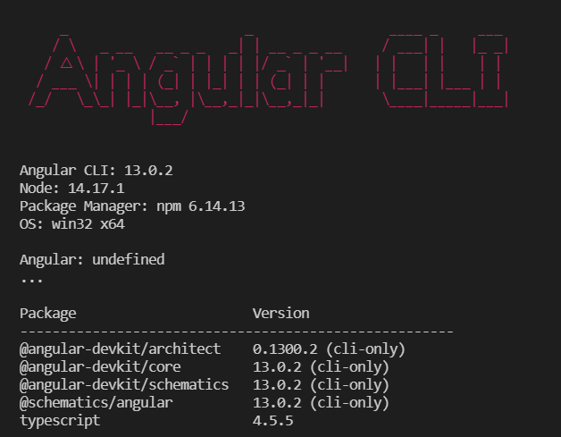
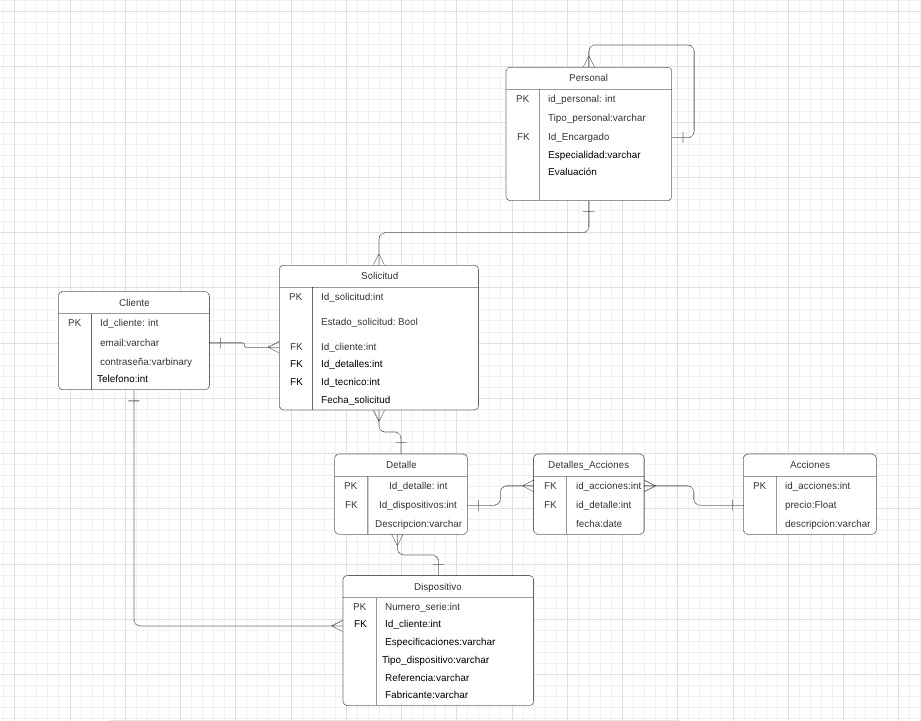

# multisoftech

# ANGULAR
primer instalamos las dependencias de angular, estan se instalan globalmente
```
SIRD> npm install -g @angular/cli
```
y podemos ejecutar el siguiente comando para ver que se instalo correctamente
```
ng v
```


ahora las dependencias del proyecto
```
SIRD> npm install
```

## Crear componente
```console
ng generate component <name_component>
```

# EJECUTAR
## frontend
dentro de 📂SIRD ejecutamos el comando
```
SIRD> npm run start
```

## BACKEND
dentro de 📂backend ejecutamos
```
backend> npm run start
```
en el siguiente link esta la collecion de rutas de la api en postman
https://www.postman.com/mannuluss/workspace/sirn/collection/18156740-232a0ce7-5f53-48d2-8358-e871a91c69f5?action=share&creator=18156740

# IONIC install
```
npm install -g @ionic/cli native-run cordova-res
```

# Base de datos (mysql)
